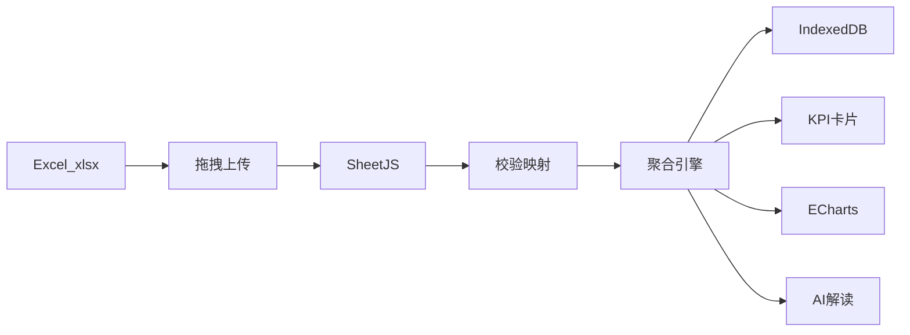

# 企业销售经营分析看板 — 初步方案

> 伊创财务分析项目 | 澳克泰 ACHTECK 工业刀具一级代理 | 数据周期 2025-06-01 ~ 2026-05-31

---

## 1. 项目定位

### 1.1 企业背景

**企业类型**：工业切削刀具一级代理贸易商，主营 [澳克泰 ACHTECK](https://www.achtecktool.com/cn/Default.aspx) 品牌产品。

| 产品线 | 典型产品 | 经营特点 |
|--------|----------|----------|
| 切削刀具 | 车削刀片（AC/PA/AT 系列）、铣刀（M 系列 Pro）、玉米铣刀 APE 等 | SKU 多、毛利差异大、技术型销售 |
| 硬质合金棒材 | 各规格牌号棒材 | 规模交易、周转模式与刀具不同 |

**利润来源**：进销差价 + 厂家规模返利。看板须同时展示 **收入规模** 与 **毛利率**，避免「增收不增利」。

### 1.2 建设目标

| 目标 | 说明 |
|------|------|
| 数据导入 | 浏览器端解析 Excel（`2025.6.1-2026.5.31.xlsx`），无需后端 |
| 多维分析 | 日期 / 业务员 / 客户类别 / 客户编码 / 商品编号 |
| 财务指标 | 收入、成本、毛利、毛利率（加权） |
| 分析方法 | 同比、环比、趋势、结构、帕累托 |
| 智能解读 | 第一期规则化报告；第二期大模型 API 增强 |
| 本地持久 | IndexedDB，刷新不丢数据 |

---

## 2. 数据规范

### 2.1 分析维度

| 维度 | 字段 | 说明 |
|------|------|------|
| 销售日期 | salesDate | 时间轴、同比环比 |
| 销售人员 | salesperson | 业绩考核 |
| 客户类别 | customerCategory | 结构分析 |
| 客户 | customerCode | **唯一键** |
| 商品编号 | productCode | SKU 帕累托、系列解析 |

### 2.2 分析指标

| 指标 | 字段 | 计算口径 |
|------|------|----------|
| 收入 | revenue | 与 ERP 一致（建议不含税，待业务确认） |
| 成本 | cost | 采购/出库成本，与收入同口径 |
| 毛利 | grossProfit | 有列用原值，否则 revenue − cost |
| 毛利率 | grossMargin | **加权** Σ毛利 / Σ收入 |

### 2.3 Excel 列名映射（已按 `data/2025.6.1-2026.5.31.xlsx` 校准）

| 逻辑字段 | 实际 Excel 列名 | 说明 |
|----------|-----------------|------|
| salesDate | 销售日期 | 2025-06-23 ~ 2026-05-29 |
| salesperson | 销售人员 | |
| customerCategory | 客户类别 | 终端客户 / 经销商 |
| customerCode | 客户编码 | 唯一键 |
| customerName | 客户名称 | |
| productCode | 商品编号 | 如 DNMG 150608E-PD3 AC150P |
| productName | 商品名称 | |
| productLine | **商品类别** | 映射为：切削刀具 / 刀柄/工具系统 / 配件及其他 |
| revenue | **销售收入** | |
| cost | **销售成本** | |
| grossProfit | **销售毛利** | |
| grossMargin | 毛利率 | 行级百分比，如 19.95% |

源文件 Sheet1 共 **8746** 行；Sheet2/Sheet3 为空。导入时若列名完全匹配，将自动应用上述映射。

### 2.4 数据质量检查

- 客户编码缺失
- 成本为 0 但有正收入
- 毛利率超出 [-100%, 100%]
- 负毛利「倒挂」交易
- 日期超出分析窗口

---

## 3. 分析方法论

### 3.1 同比 / 环比

- 粒度：月 / 季 / 年
- 收入、成本、毛利：增长率 = (当期 − 对比期) / |对比期|
- 毛利率：用 **百分点 (pp)**，如 18.5% → 20.1% = +1.6pp

### 3.2 趋势

- 月度收入 / 毛利 / 毛利率三线图
- 3 个月滚动均线
- Top 5 业务员毛利趋势

### 3.3 结构

- 客户类别堆叠柱 + 占比
- 产品线（刀具 vs 棒材）毛利贡献
- 销售人员毛利排名
- 下钻：类别 → Top 客户

### 3.4 帕累托（80/20）

- 维度：客户编码 / 商品编号 / 销售人员
- 按毛利降序 + 累计占比曲线
- 标注 80% 毛利截止线

### 3.5 增值分析（P2）

| 方法 | 用途 |
|------|------|
| 客户四象限（收入 × 毛利率） | 明星 / 金牛 / 问题 / 瘦狗 |
| HHI 集中度 | 客户依赖风险 |
| 产品系列前缀解析 | M→铣刀 Pro，AC→车削钢件 |
| 库存周转 | 需补充库存 Sheet |

---

## 4. 看板 UI 设计

```
┌─────────────────────────────────────────────────────────┐
│  销售经营分析看板              [导入] [设置] [主题]      │
├─────────────────────────────────────────────────────────┤
│  筛选：日期 | 业务员 | 客户类别 | 客户 | 商品 | 产品线   │
├─────────────────────────────────────────────────────────┤
│  [收入] [成本] [毛利] [毛利率]  KPI 四卡片               │
├──────────────────────────────┬──────────────────────────┤
│  同比环比 | 趋势 | 结构 | 帕累托 │  AI 专业解读           │
├──────────────────────────────┴──────────────────────────┤
│  明细数据表（分页、排序、导出 CSV）                        │
└─────────────────────────────────────────────────────────┘
```

---

## 5. AI 分析设计

### 5.1 第一期：规则化解读

1. **经营总览**：红黄绿阈值（毛利率 < 15% 预警）
2. **异常检测**：低毛利客户/SKU、负毛利、业务员离散度
3. **结构洞察**：类别占比、Top1 客户 > 30% 风险
4. **帕累托建议**：聚焦 Top 20% 维护
5. **行业语境**：刀具 vs 棒材、高端系列占比

### 5.2 第二期：大模型 API

- 设置页：Provider / Base URL / Model / API Key（localStorage）
- 脱敏摘要 JSON → executive summary、风险清单、经营建议

---

## 6. 技术架构



| 模块 | 技术 |
|------|------|
| Excel | SheetJS |
| 图表 | ECharts 5 |
| 存储 | IndexedDB |
| 部署 | 静态 HTML |

### 目录结构

```
伊创财务分析项目/
├── docs/销售经营分析看板-初步方案.md   ← 本文档
├── index.html
├── css/dashboard.css
├── js/
│   ├── config.js      # 字段映射、阈值、系列规则
│   ├── parser.js      # Excel 导入
│   ├── analytics.js   # 聚合计算
│   ├── charts.js      # 图表封装
│   ├── ai-insights.js # 规则 + API 解读
│   └── app.js         # 页面交互
├── lib/               # xlsx、echarts
└── data/
    └── 2025.6.1-2026.5.31.xlsx
```

---

## 7. 澳克泰产品系列参考

| 前缀/系列 | 品类 |
|-----------|------|
| AC / PA / AT | 车削刀片、金属陶瓷 |
| M110/M115/M116 | 铣刀 Pro |
| APE | 玉米铣刀 |
| 棒材 / BAR | 硬质合金棒材 |

---

## 8. 分步开发计划

| 步骤 | 内容 | 状态 |
|------|------|------|
| Step 1 | 生成本方案 MD 文档 | ✅ |
| Step 2 | HTML/CSS/JS 骨架 + lib | ✅ |
| Step 3 | Excel 导入、列映射、IndexedDB | ✅ |
| Step 4 | analytics.js 聚合引擎 | ✅ |
| Step 5 | 图表看板 + 筛选联动 | ✅ |
| Step 6 | 规则化 AI + API 配置页 | ✅ |
| Step 7 | 按真实 Excel 校准列映射 | ✅ |

---

## 9. 下一步

1. 确认本方案 MD
2. 开始 Step 2 搭建页面骨架
3. 上传 Excel 至 `data/` 目录后执行 Step 7 列映射校准
4. 确认收入/成本是否为不含税口径

---

*文档版本 v1.0 | 2026-06-15*
